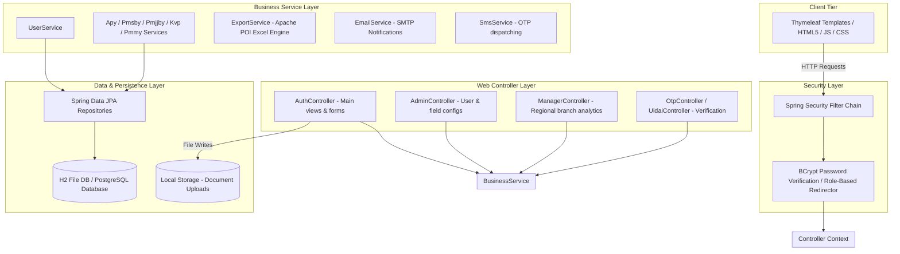
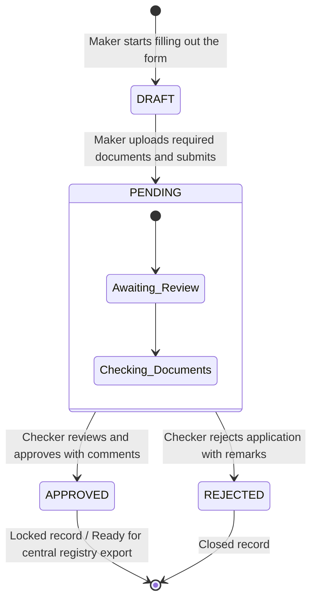

# 🏦 Vartalaap Banking Portal

Vartalaap is a web portal built with Spring Boot designed to help bank branches manage and track applications for central government social security schemes (specifically APY, PMJJBY, PMSBY, KVP, and PMMY). 

Rather than relying on manual paperwork, the system digitizes the entire lifecycle using a Maker-Checker workflow. Data entered at the branch level (by a Maker) goes through a formal audit and review process by a supervisor (Checker) before being approved. It also features a dynamic form engine that lets administrators toggle or add custom form fields on the fly without editing code or redeploying the service.

---

## 📐 How the System is Structured

### 1. High-Level Architecture
The application follows a standard layered architecture. Requests pass through Spring Security for authentication and role redirection, hit the MVC controllers, invoke business logic in the services layer, and query the database via Spring Data JPA.



### 2. Application Workflow (State Machine)
To prevent unauthorized submissions, each scheme application moves through the following stages:



---

## 🌟 Core Modules & Features

### ⚙️ The Dynamic Form Engine
Instead of hardcoding form inputs for every scheme, the UI is built dynamically using configs stored in the database (`FormConfig` table).

*   **Static Fields**: Standard fields (like Name, DOB, Aadhar Number). Admins can enable or disable these globally.
*   **Dynamic Fields**: Custom inputs (such as specific branch declarations or extra checkboxes) added by Admins for specific branches.
*   **JSON Storage**: When a form is submitted, client-side scripts package all custom field values into a single JSON object. This object is saved directly into the `additional_data` column of the scheme's database table, keeping the schema clean.

### 👥 User Roles & Access Control
Access to pages and actions is restricted based on user roles configured via Spring Security:

| Role | Security Authority | Main Responsibility |
| :--- | :--- | :--- |
| **Maker (User)** | `ROLE_MAKER` or `ROLE_USER` | Accesses the main user dashboard. Fills out forms, uploads documents, triggers mock OTP verifications, and tracks application status. |
| **Checker** | `ROLE_APPROVER` | Accesses the approver dashboard. Inspects submitted forms and uploaded documents, and decides to approve or reject them. |
| **Branch Admin** | `ROLE_ADMIN` | Accesses admin settings. Registers new branch accounts, changes roles, triggers automated temp password emails, and configures form layouts. |
| **Manager** | `ROLE_MANAGER` | Accesses the manager dashboard. Looks at analytical reports and performance metrics across different branches. |

---

## 📂 Codebase Directory Layout

```
├── AlterDb.java                # Database helper script for manual schema changes
├── Dockerfile                  # Multi-stage build configuration for Docker containerization
├── pom.xml                     # Maven dependencies and project config
├── uploads/                    # Directory where user-uploaded documents are stored locally
├── data/                       # Local directory storing the file-based H2 database
└── src/
    └── main/
        ├── java/com/example/demo/
        │   ├── DemoApplication.java    # App entrypoint & automatic user seeder
        │   ├── config/                 # Security, Async, and Web config files
        │   ├── controller/             # Controllers handling routes and API requests
        │   ├── dto/                    # Data Transfer Objects for reports and dashboards
        │   ├── model/                  # JPA Entity definitions (User, FormConfig, Schemes)
        │   ├── repository/             # Database access interfaces
        │   └── service/                # Business logic (exports, email, mock SMS, etc.)
        └── resources/
            ├── application.properties  # Main configuration file (DB credentials, email ports)
            ├── static/                 # Static assets (CSS, custom JS, images)
            └── templates/              # HTML layout templates rendered by Thymeleaf
```

---

## 🛠️ How to Get Started

### Prerequisites
*   **Java**: JDK 17 (or newer)
*   **Build tool**: Maven 3.x

### 1. Build and Run Locally
You can build the project and launch the embedded Tomcat server using these commands:
```bash
# Build and download dependencies
mvn clean install

# Start the application
mvn spring-boot:run
```

Once started, the app runs on port `8080`. Open **`http://localhost:8080`** in your browser.

### 2. Running with a Production Database (Optional)
By default, the application runs on a local, zero-setup file database (`data/demo`). If you want to connect to a production database (like PostgreSQL), pass the credentials via environment variables when launching:

```bash
export DB_URL=jdbc:postgresql://your-db-host:5432/vartalaap_db
export DB_USERNAME=postgres
export DB_PASSWORD=yoursecurepassword
export DB_DRIVER=org.postgresql.Driver
export DB_DIALECT=org.hibernate.dialect.PostgreSQLDialect

mvn spring-boot:run
```

---

## 🔐 Default Test Accounts

To make it easy to explore the different dashboards, the application automatically seeds these test accounts on startup (defined in [DemoApplication.java](file:///Users/adikansal2608/Desktop/Vartalaap%20Banking/src/main/java/com/example/demo/DemoApplication.java)):

*   **Administrator Account** (Manage users/forms):
    *   **Username**: `admin`
    *   **Password**: `admin123`
*   **Maker Account** (Submit applications):
    *   **Username**: `maker01`
    *   **Password**: `maker123`
*   **Checker Account** (Approve/Reject applications):
    *   **Username**: `approver01`
    *   **Password**: `approver123`

---

## 📁 Diagnostic Tools & Utilities

*   **H2 Database Console**: Query the database tables directly at `http://localhost:8080/h2-console`
    *   *JDBC URL*: `jdbc:h2:file:./data/demo`
    *   *User*: `sa`
    *   *Password*: *(leave blank)*
*   **Health Check Endpoint**: Simple API to verify that the app is responding and connected to the database
    *   *URL*: `http://localhost:8080/api/health`
