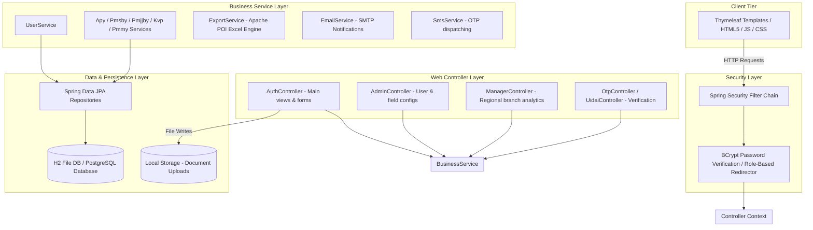
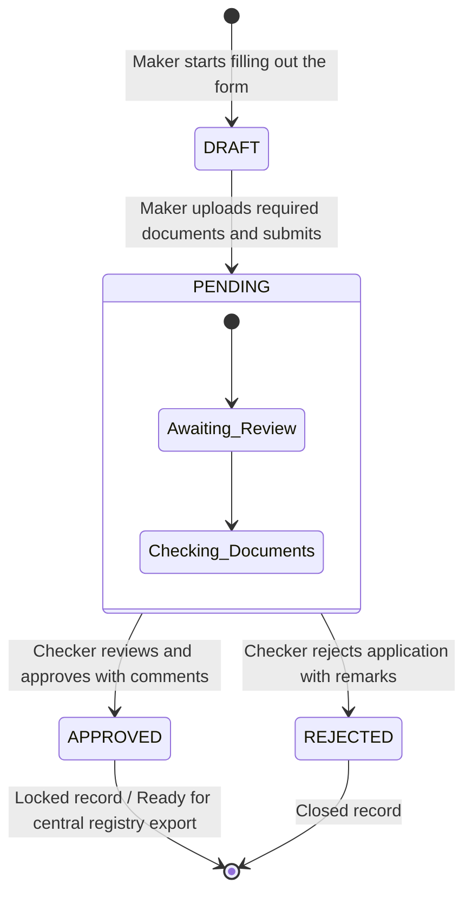

# Vartalaap Banking Portal

Vartalaap is a web portal built on Spring Boot that helps bank branches digitize and track applications for central government social security schemes—specifically APY, PMJJBY, PMSBY, KVP, and PMMY. 

Rather than relying on manual paperwork, the system digitizes the entire lifecycle using a Maker-Checker workflow. Data entered at the branch level (by a Maker) goes through a formal audit and review process by a supervisor (Checker) before being approved. It also features a dynamic form engine that lets administrators toggle or add custom form fields on the fly without editing code or redeploying the service.

---

## How the System is Structured

### 1. High-Level Architecture
The application follows a standard layered architecture. Requests pass through Spring Security for authentication and role redirection, hit the MVC controllers, invoke business logic in the services layer, and query the database via Spring Data JPA.



### 2. Application Workflow & State Transitions
To maintain audit logs and prevent internal fraud, every application follows a single-direction state machine:



---

## Deep Dive: Key Engineering Solutions

### 1. The Dynamic Form Engine (No-Migration Schema Strategy)
If you've ever worked with government forms, you know they change constantly. Adding a database column and redeploying the app every time a form gets a new checkbox is a nightmare. 

To solve this, we built a hybrid database structure:
*   **Static Columns**: Standard fields like name, Aadhar number, and phone number are mapped to actual database columns in their respective entities (e.g., `ApyForm`, `KvpForm`).
*   **Dynamic Configurations**: The `FormConfig` table stores custom fields added by admins (such as "Is the applicant a taxpayer?").
*   **Client-Side Serialization**: In the Thymeleaf templates, we load static inputs, fetch the branch's custom `FormConfig` entries, and render them. When the Maker clicks "Submit", a JavaScript script intercepts the submit event, gathers all dynamic inputs, serializes them into a single JSON string, and places it into a hidden input mapped to the entity's `additional_data` column.
*   **Deserialization**: When the Checker reviews the form, the controller reads the JSON string from `additional_data` and parses it back into readable key-value pairs in the UI.

### 2. Document Upload Pipeline
To avoid storing heavy binary assets (Aadhar copies, PAN cards, cancelled cheques) directly inside the relational database, we use a local filesystem store:
*   The upload controller (`AuthController.saveFile`) intercepts binary files via `MultipartFile`.
*   To prevent file name collisions (e.g., two users uploading a file named `aadhar.jpg`), we generate a unique UUID and prepend it to the file name (`UUID + "_" + originalFileName`).
*   The file is saved to the local `uploads/` directory on the server.
*   Only the relative file path string (e.g., `/uploads/3f82..._aadhar.jpg`) is saved in the database. When the Checker views the application, Thymeleaf maps this path to render the document preview directly in the browser.

### 3. SMS & OTP Verification Dispatcher
To mock real banking OTP behaviors (like UIDAI Aadhar verification or secure logins), we built a pluggable SMS service:
*   In `application.properties`, you can configure `sms.provider`.
*   If set to `mock`, the `MockSmsService` intercepts the request and prints the generated OTP to the standard out terminal logs. This makes local testing free and simple since you don't need active network connectivity or API keys.
*   If set to `fast2sms`, the application switches to `Fast2SmsService`, sending real SMS messages using their REST API endpoints.

---

## User Roles & Access Management

Spring Security controls path-level access based on roles pre-configured during startup:

| Role | Authority | Responsibilities |
| :--- | :--- | :--- |
| **Maker (User)** | `ROLE_MAKER` or `ROLE_USER` | Accesses `/dashboard`. Enters applicant details, triggers UIDAI verification, uploads files, and views status history. |
| **Checker** | `ROLE_APPROVER` | Accesses `/approver_dashboard`. Reviews pending applications, examines document uploads, and flags entries as `APPROVED` or `REJECTED` with notes. |
| **Branch Admin** | `ROLE_ADMIN` | Accesses `/admin`. Provisions new user accounts, toggles scheme fields, and triggers password recovery flows. |
| **Manager** | `ROLE_MANAGER` | Accesses `/manager_dashboard`. Views metrics across all branch locations and exports consolidated reports. |

---

## Codebase Directory Layout

```
├── AlterDb.java                # Helper script to modify the database structure manually
├── Dockerfile                  # Multi-stage build setup to bundle and package the app in a container
├── pom.xml                     # Maven project configuration and dependencies
├── uploads/                    # Folder where uploaded PDF and image documents are stored
├── data/                       # Directory where the H2 file-based database is stored locally
└── src/
    └── main/
        ├── java/com/example/demo/
        │   ├── DemoApplication.java    # App entrypoint and seeding script for test accounts
        │   ├── config/                 # Configurations for security, web filters, and async executors
        │   ├── controller/             # Route handlers and API controller classes
        │   ├── dto/                    # Data Transfer Objects used to compile dashboard stats
        │   ├── model/                  # JPA Entity definitions (User, FormConfig, Schemes)
        │   ├── repository/             # JPA database query interfaces
        │   └── service/                # Business logic classes (Excel export, email SMTP, SMS dispatchers)
        └── resources/
            ├── application.properties  # Main configuration file (SMTP server setup, db paths)
            ├── static/                 # Static files (CSS, client-side JS libraries)
            └── templates/              # HTML layout views
```

---

## Running the Project

### Prerequisites
*   **Java Runtime**: JDK 17 (or newer)
*   **Build tool**: Maven 3.x

### 1. Running Locally
Build the packages and spin up the embedded Tomcat server:
```bash
# Clean project and download all dependencies
mvn clean install

# Start the application
mvn spring-boot:run
```
Open **`http://localhost:8080`** in your web browser.

### 2. Switching to PostgreSQL (Optional)
By default, the application runs on a local H2 file database (`data/demo`). If you want to connect to a production instance of PostgreSQL, pass the datasource variables through the environment:

```bash
export DB_URL=jdbc:postgresql://your-db-host:5432/vartalaap_db
export DB_USERNAME=postgres
export DB_PASSWORD=yoursecurepassword
export DB_DRIVER=org.postgresql.Driver
export DB_DIALECT=org.hibernate.dialect.PostgreSQLDialect

mvn spring-boot:run
```

---

## Pre-seeded Credentials for Local Testing

When the application boots, it automatically creates three accounts if they don't already exist so you don't have to register manually (see [DemoApplication.java](file:///Users/adikansal2608/Desktop/Vartalaap%20Banking/src/main/java/com/example/demo/DemoApplication.java)):

*   **Administrator Account**:
    *   **Username**: `admin`
    *   **Password**: `admin123`
*   **Maker Account**:
    *   **Username**: `maker01`
    *   **Password**: `maker123`
*   **Checker Account**:
    *   **Username**: `approver01`
    *   **Password**: `approver123`

---

## Diagnostic Tools

*   **H2 Database Interface**: Query active tables directly at `http://localhost:8080/h2-console`
    *   *JDBC URL*: `jdbc:h2:file:./data/demo`
    *   *User*: `sa`
    *   *Password*: *(leave blank)*
*   **App Health Check**: Simple JSON service checking database connectivity
    *   *URL*: `http://localhost:8080/api/health`
